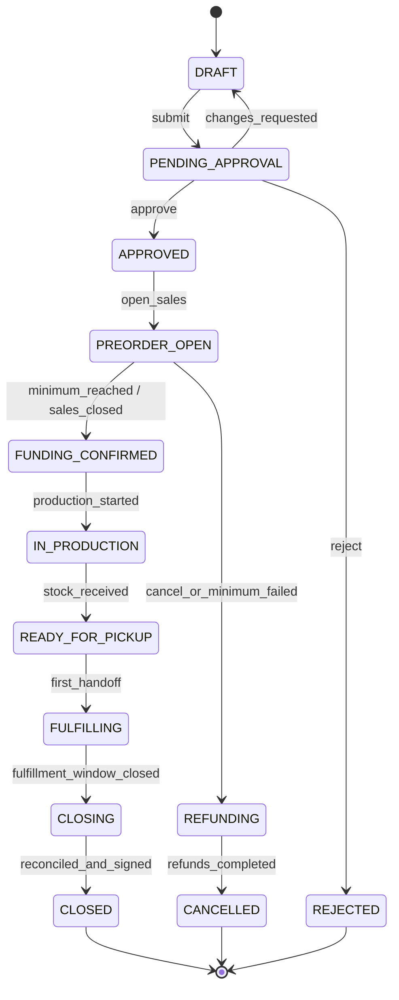
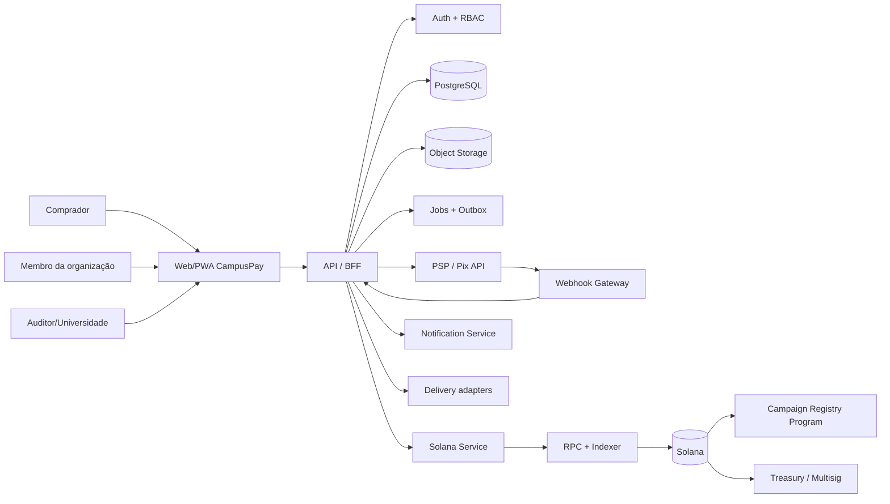

# CampusPay — contexto mestre de produto e engenharia

> **Status:** documento-base para descoberta, protótipo, hackathon e implementação do MVP  
> **Atualizado em:** 06 de setembro de 2026  
> **Responsabilidade:** Product + Tech Lead  
> **Regra:** este documento é a fonte de verdade. Decisões divergentes precisam ser registradas na seção de ADRs antes de entrar no produto.

---

## 0. Resumo obrigatório para todo desenvolvedor

A CampusPay é uma infraestrutura de campanhas comerciais para organizações estudantis. Ela conecta aprovação, pré-venda, pagamento, produção, estoque, retirada/entrega e prestação de contas em um único histórico verificável.

O problema não é apenas receber pagamentos nem criar outro marketplace. O problema é que uma campanha costuma ficar fragmentada entre Forms, Pix, planilhas, WhatsApp, contas pessoais e listas de retirada. Ao final, a tesouraria precisa reconstruir manualmente:

- quanto foi vendido e efetivamente recebido;
- quais despesas foram autorizadas e comprovadas;
- quais pedidos foram produzidos, entregues, cancelados ou reembolsados;
- quanto sobrou em caixa e estoque;
- qual foi a destinação do resultado;
- quem aprovou cada decisão;
- quais informações precisam ser apresentadas a membros, conselho fiscal ou universidade;
- o que deve ser transferido para a próxima gestão.

### A promessa do produto

> Uma organização abre uma campanha, vende, recebe, produz, entrega e fecha suas contas sem precisar reconstruir o histórico em cinco ferramentas diferentes.

### O que cada lado recebe

- **Organização estudantil:** operação simples, reconciliação automática e continuidade entre gestões.
- **Comprador:** checkout confiável, status claro, retirada previsível e política de reembolso visível.
- **Conselho fiscal ou universidade:** visão permissionada, documentos e relatório de fechamento verificável.
- **Fornecedor:** demanda consolidada, marco de produção e pagamento previsível.
- **CampusPay:** uma posição defensável entre comércio, governança e tesouraria estudantil.

### As seis decisões que não podem se perder

1. **Não somos um banco:** no MVP, a CampusPay não custodia reais, não oferece conta bancária e não promete rendimento.
2. **Não somos apenas um marketplace:** o diferencial é o ciclo completo e auditável da campanha.
3. **Pix e Solana coexistem:** adoção brasileira exige Pix; Solana adiciona tesouraria programável, reconciliação e prova verificável.
4. **Dados pessoais nunca vão para a blockchain:** nomes, telefones, endereços, itens individuais e comprovantes permanecem offchain.
5. **Entrega padrão é retirada no campus:** logística sob demanda é opcional, posterior e paga separadamente.
6. **Sem token especulativo:** não criar token próprio, NFT decorativo ou governança artificial para justificar Web3.

---

## 1. Contexto do hackathon

A proposta se encaixa principalmente na track **Vida universitária**, que cita pagamentos entre estudantes e gestão de entidades estudantis, e secundariamente em **Dinheiro e pagamentos**.

O hackathon avalia problema (30%), solução (25%), fit cultural brasileiro (20%), uso da Solana (15%) e clareza (10%). Portanto, o time deve priorizar a especificidade da dor e o papel não decorativo da blockchain. Código e produto completo não são critérios obrigatórios. A entrega é um pitch de até cinco minutos e uma descrição de até 300 palavras.

### Mensagem central para pitch e produto

> Vender uma camiseta é simples. Provar quanto entrou, quanto saiu, quem recebeu e para onde foi o saldo é o trabalho que quebra a operação.

### Recorte recomendado para demonstração

Uma atlética vende 150 camisetas em pré-venda, com quatro tamanhos. A campanha precisa ser aprovada, atingir quantidade mínima, pagar o fornecedor, entregar no campus e gerar prestação de contas. A demonstração acompanha uma campanha do início ao fechamento.

### O que o pitch precisa demonstrar

1. Um problema real, recorrente e reconhecível.
2. A diferença entre “checkout” e “fechamento de campanha”.
3. Um fluxo simples para quem nunca usou cripto.
4. Solana resolvendo confiança, reconciliação e governança — não sendo apenas um selo.
5. Um MVP pequeno e executável.

Fonte oficial: [Hackathon Universitária — Superteam Brasil](https://uni.superteam.com.br/).

---

## 2. Definição precisa do problema

### 2.1 Problema raiz

Organizações estudantis não possuem uma fonte única e confiável que conecte a autorização de uma campanha ao dinheiro recebido, aos custos, ao estoque, às entregas e ao fechamento financeiro.

### 2.2 Sintomas visíveis

- Pedidos duplicados ou sem pagamento identificado.
- Pix recebido sem vínculo inequívoco com pedido.
- Pagamentos em conta pessoal de presidente ou tesoureiro.
- Estoque contado manualmente e sem trilha de movimentação.
- Tamanhos e variantes alterados por mensagens.
- Notas e recibos espalhados em celulares e e-mails.
- Entrega confirmada por memória, lista impressa ou mensagem.
- Reembolsos sem reflexo uniforme no caixa e no estoque.
- Saldo final calculado dias ou semanas depois.
- Prestação de contas produzida como tarefa extraordinária, não como resultado natural da operação.
- Mudança de gestão com perda de senha, planilha, histórico e justificativas.
- Dificuldade de demonstrar conformidade quando a universidade cede espaço, marca, infraestrutura ou recursos.

### 2.3 O problema não é uniforme entre instituições

Não existe um único órgão centralizador nacional. Dependendo da entidade e da universidade, a prestação pode ser devida a:

- assembleia geral e associados;
- conselho fiscal;
- coordenação ou colegiado de curso;
- extensão ou assistência estudantil;
- direção do campus ou reitoria;
- comissão organizadora de evento;
- professor orientador;
- contador e órgãos fiscais, quando há CNPJ.

O produto deve oferecer **templates configuráveis de aprovação e relatório**, não assumir um rito universal.

### 2.4 Evidências institucionais

- Regulamentos de empresas juniores podem exigir CNPJ, emissão de nota, supervisão, conselho fiscal, acompanhamento do colegiado e relatório anual. Exemplo: [Resolução CONSU/IFAC nº 176/2024](https://www.ifac.edu.br/orgaos-colegiados/conselhos/consu/resolucoes/2024/resolucao-consu-ifac-no-176-2024-de-12-de-marco-de-2024).
- Há universidades em que a manutenção do reconhecimento de atléticas depende de relatórios e demonstrações financeiras. Exemplo: [regulamento da UFSB](https://ufsb.edu.br/images/Resolu%C3%A7%C3%A3o_n%C2%BA_18_-_Estabelece_as_normas_para_o_reconhecimento_e_o_funcionamento_de_associa%C3%A7%C3%B5es_atl%C3%A9ticas_acad%C3%AAmicas_na_Universidade_Federal_do_Sul_da_Bahia.pdf).
- Há editais de venda no campus que exigem meta financeira, plano de destinação e prestação de contas. Exemplo: [Edital de Vendas Estudantis do IFSP](https://www.rgt.ifsp.edu.br/portal/arquivos/2025/10/Edital%20047-2025_Vendas_Estudantis_SNCT.pdf).

Esses exemplos validam a categoria da dor, mas não autorizam tratar todas as entidades como iguais.

### 2.5 Jobs to be done

#### Tesoureiro

> Quando executo uma campanha, quero que cada entrada, saída e entrega seja conciliada automaticamente, para fechar e apresentar as contas sem reconstruir o histórico.

#### Presidente ou gestor

> Quando submeto uma campanha, quero saber o que precisa ser aprovado e acompanhar se ela está dentro do orçamento, para não colocar a entidade ou a gestão em risco.

#### Comprador

> Quando compro um item de uma entidade, quero saber se meu pagamento foi reconhecido e como receberei o produto, para confiar mesmo que a produção leve semanas.

#### Conselho fiscal ou universidade

> Quando preciso revisar uma campanha, quero ver valores, documentos, aprovações e exceções em um relatório consistente, sem acessar dados pessoais desnecessários.

#### Próxima gestão

> Quando assumo a organização, quero receber um histórico estruturado de campanhas, saldos, pendências e políticas, para não depender da memória da diretoria anterior.

---

## 3. Público-alvo e estratégia de entrada

### 3.1 Segmento inicial recomendado

Atléticas, centros acadêmicos e diretórios que já realizam pré-vendas de camisetas, moletons, kits, ingressos ou produtos de eventos.

Critérios de seleção para piloto:

- 50 a 500 compradores potenciais;
- pelo menos duas campanhas por ano;
- uma pessoa responsável por tesouraria;
- produção por lote ou quantidade mínima;
- retirada concentrada no campus;
- dor comprovável com conciliação ou troca de gestão;
- abertura para usar uma wallet institucional ou tesouraria multisig no piloto.

### 3.2 Segmentos posteriores

- Empresas juniores: maior formalidade, CNPJ e necessidade documental.
- Repúblicas: rateio de despesas e compras coletivas.
- Comissões de formatura: alta arrecadação e longa duração, mas risco jurídico e financeiro maior.
- Eventos universitários: ingressos, credenciais e venda de itens.
- Projetos de extensão e coletivos: campanhas com finalidade vinculada.
- Universidades: licença institucional de supervisão e templates.

### 3.3 Cliente, usuário e beneficiário

- **Usuário operador:** estudante responsável pela organização.
- **Usuário pagador:** comprador.
- **Cliente inicial:** organização estudantil.
- **Cliente institucional futuro:** universidade ou rede educacional.
- **Beneficiário indireto:** nova gestão, conselho fiscal, fornecedor e comunidade acadêmica.

### 3.4 Modelo comercial inicial

Priorizar SaaS, não intermediação financeira:

- plano gratuito para uma campanha ativa;
- plano da organização com campanhas, relatórios e múltiplos gestores;
- licença institucional para dashboard, políticas e templates;
- taxa de serviço apenas se juridicamente e operacionalmente adequada;
- custo de entrega repassado como linha separada;
- patrocínio de taxas onchain com limite por organização/campanha.

Não basear o modelo de negócio em spread cambial, custódia de fundos ou emissão de ativo.

---

## 4. Posicionamento e diferenciais

### 4.1 Categoria

**Campaign operations + verifiable treasury for student organizations.**

Em português: infraestrutura de campanhas e tesouraria verificável para organizações estudantis.

### 4.2 Diferenciais defensáveis

1. **Da autorização ao fechamento:** concorrentes normalmente resolvem venda, pagamento ou despesa; a CampusPay conecta o ciclo completo.
2. **Prestação de contas como output nativo:** o relatório nasce dos eventos operacionais, não de uma planilha preenchida depois.
3. **Continuidade entre gestões:** papéis, aprovações, documentos e histórico pertencem à organização, não ao estudante que está saindo.
4. **Workflow institucional configurável:** cada universidade define aprovadores, limites, campos e destinatários sem mudar o produto-base.
5. **Hybrid rails:** Pix para alcance brasileiro; Solana para tesouraria, pagamentos em stablecoin, regras e provas.
6. **Transparência com privacidade:** valores agregados e hashes verificáveis; PII estritamente offchain.
7. **Entrega física incorporada:** QR/PIN fecha o ciclo entre pagamento e item entregue.
8. **Não custodial por padrão:** reduz risco, dependência da plataforma e complexidade regulatória.
9. **Governança proporcional:** aprovação e multisig onde importa; sem transformar toda decisão em votação.

### 4.3 Comparação conceitual

| Alternativa | O que resolve | O que continua faltando |
|---|---|---|
| Forms + planilha | coleta e controle manual | conciliação, permissões, auditoria, entrega e continuidade |
| Loja virtual genérica | catálogo e checkout | aprovação institucional, finalidade, conselho fiscal e fechamento |
| Banco/Pix | movimentação financeira | vínculo com pedido, estoque, documento e destinação |
| App de despesas | gastos e recibos | vendas, produção, fulfillment e experiência do comprador |
| DAO/multisig | controle compartilhado de wallet | operação física, Pix, documentos e UX não cripto |
| CampusPay | campanha ponta a ponta | depende de validação, integrações e adoção institucional |

### 4.4 Frase comercial

> A CampusPay transforma campanhas estudantis em operações rastreáveis, do primeiro pedido ao relatório final.

---

## 5. Princípios de produto

1. **Web2-simple, Web3-verifiable:** o usuário não deve aprender blockchain para comprar uma camiseta.
2. **Uma campanha, uma fonte de verdade:** todo evento relevante precisa convergir para o ledger da campanha.
3. **Correção por reversão:** registros financeiros confirmados não são apagados ou sobrescritos; ajustes geram lançamentos inversos e justificativa.
4. **Menor exposição possível:** transparência financeira não significa exposição de pessoas.
5. **Permissão mínima:** membros veem apenas o necessário para sua função.
6. **Aprovação não pode travar operação simples:** políticas devem ser proporcionais a valor, risco e uso institucional.
7. **Mobile first:** a operação acontece no celular, especialmente cobrança, estoque e retirada.
8. **Falhas são estados explícitos:** pagamento expirado, retirada perdida, devolução e divergência não podem desaparecer em “observações”.
9. **Blockchain só para fatos que precisam ser compartilhados sem confiança unilateral.**
10. **O relatório final precisa ser reproduzível:** os totais devem poder ser recalculados a partir de eventos e documentos.

---

## 6. Escopo funcional

### 6.1 P0 — MVP essencial

#### Identidade e organização

- Login por e-mail/social.
- Conexão de wallet opcional para comprador e obrigatória apenas para funções onchain.
- Criação de organização com nome, instituição, tipo e responsáveis.
- Convite de membros e RBAC.
- Registro de mandato/período de gestão.
- Política básica de aprovação e tesouraria.

#### Campanhas

- Criar campanha com objetivo, destinação, período, meta mínima e orçamento.
- Cadastrar produto, variantes, preço, quantidade e prazo estimado.
- Anexar orçamento do fornecedor.
- Submeter, aprovar, rejeitar ou solicitar ajuste.
- Abrir e encerrar pré-venda.
- Congelar os termos relevantes quando a primeira venda ocorrer.

#### Pedidos e checkout

- Página pública da campanha.
- Carrinho simples de uma única organização/campanha.
- Identificação mínima do comprador.
- Escolha de variante e retirada.
- Reserva temporária de unidade ou capacidade.
- Pedido com código e status.
- Pix por provedor ou fluxo simulado no hackathon.
- Stablecoin em Solana via payment request/QR.
- Reconciliação pelo identificador único do pedido.

#### Financeiro

- Ledger de dupla entrada.
- Receita, despesa, taxa, reembolso e ajuste.
- Anexo de nota/recibo com metadados.
- Categorias de despesa.
- Visão de previsto versus realizado.
- Saldo por rail: Pix/BRL e token onchain.
- Fechamento bloqueado quando houver divergência crítica.

#### Produção e estoque

- Transformar pedidos pagos em quantidade a produzir.
- Lote de produção com fornecedor, custo e prazo.
- Entrada de estoque por variante.
- Reserva de item para pedido.
- Movimentação auditável de estoque.

#### Retirada

- Criar janela e ponto de retirada.
- Gerar QR/PIN por pedido.
- Tela de scanner para membro autorizado.
- Confirmar entrega com operador, data e dispositivo.
- Impedir confirmação duplicada.
- Marcar exceção e agendar repescagem.

#### Prestação de contas

- Relatório com receita bruta, custos, taxas, reembolsos, estoque e saldo líquido.
- Lista de documentos e aprovações.
- Resumo público sem PII.
- Visão permissionada para auditor/conselho/universidade.
- Snapshot imutável do fechamento.
- Hash do snapshot ancorado em Solana.
- Exportação em PDF/CSV.

### 6.2 P1 — piloto real

- Integração Pix Cobrança com PSP e webhooks.
- Tesouraria institucional multisig.
- Patrocínio de taxas onchain.
- Templates de universidade.
- Fluxo de reembolso parcial.
- Disputas e exceções de fulfillment.
- Notificações por e-mail/WhatsApp opt-in.
- Handover entre gestões.
- Portal de fornecedor.
- Múltiplos pontos de retirada.
- Dashboard institucional consolidado.
- Relatório comparável entre campanhas.

### 6.3 P2 — escala

- Integração com entrega sob demanda.
- Frete nacional e etiquetas.
- Identidade institucional/federação de login.
- Integração com ERP/contabilidade.
- Políticas avançadas por faixa de valor.
- Orçamentos concorrentes e procurement.
- Ramps fiat/stablecoin conforme regulação.
- Analytics e previsão de demanda.
- Marketplace de descoberta entre organizações.
- White label para universidades.

### 6.4 Fora de escopo até decisão explícita

- Token CampusPay.
- NFT de recibo ou prova de entrega.
- Crédito, empréstimo ou antecipação de recebíveis.
- Rendimento sobre saldo.
- Custódia própria de reais.
- Conta de pagamento própria.
- Marketplace nacional multivendedor no MVP.
- Entrega porta a porta feita por voluntários como padrão.
- Armazenamento de PII, nota fiscal ou endereço onchain.
- Votação onchain para cada decisão operacional.
- Liberação automática e irreversível baseada apenas em webhook de transportadora.

---

## 7. Papéis e permissões

### 7.1 Papéis

- **Platform Admin:** operação técnica, suporte e configuração global; não movimenta tesouraria da entidade.
- **Institution Admin:** configura templates e visualiza organizações autorizadas.
- **Institution Auditor:** revisa campanhas e relatórios, sem editar operação.
- **Organization Owner/President:** administra membros e políticas.
- **Treasurer:** gerencia financeiro, despesas, reconciliação e fechamento.
- **Campaign Manager:** configura produto, comunicação, produção e janelas.
- **Fulfillment Member:** vê apenas dados necessários para separar e confirmar retirada.
- **Fiscal Council/Auditor:** consulta ledger, documentos e relatórios; registra parecer.
- **Buyer:** gerencia seus pedidos e dados.
- **Supplier:** recebe ordem de produção e atualiza marcos autorizados.

### 7.2 Matriz resumida

| Ação | Presidente | Tesoureiro | Campanha | Fulfillment | Auditor | Instituição |
|---|---:|---:|---:|---:|---:|---:|
| Criar campanha | ✓ | ✓ | ✓ | — | — | — |
| Submeter campanha | ✓ | ✓ | ✓ | — | — | — |
| Aprovar campanha | política | política | — | — | parecer | se exigido |
| Registrar despesa | ✓ | ✓ | limitado | — | — | — |
| Aprovar despesa | política | política | — | — | parecer | se exigido |
| Confirmar retirada | — | ✓ | ✓ | ✓ | — | — |
| Ver PII do pedido | mínimo | mínimo | mínimo | somente retirada | — | — |
| Fechar campanha | coassina | prepara | — | — | parecer | se exigido |
| Ver relatório | ✓ | ✓ | ✓ | resumo | ✓ | permissionado |
| Movimentar wallet | multisig | multisig | — | — | — | nunca por padrão |

### 7.3 Regras de acesso

- Permissão é atribuída por organização e mandato.
- Um usuário pode ter papéis diferentes em entidades diferentes.
- Acesso expira ao fim da gestão, preservando autoria no histórico.
- Exportação de PII deve exigir escopo, motivo e auditoria.
- Suporte da plataforma usa acesso temporário e rastreado.
- Universidade não recebe automaticamente dados pessoais de compradores.

---

## 8. Jornadas principais

### 8.1 Onboarding da organização

1. Usuário cria a organização.
2. Informa instituição, tipo, CNPJ se houver e canal oficial.
3. Convida ao menos dois responsáveis.
4. Seleciona modelo de governança: simples, conselho fiscal ou institucional.
5. Conecta wallet/tesouraria ou adia para modo Pix/offchain.
6. Define política de aprovação.
7. Sistema produz checklist de prontidão.

### 8.2 Criação e aprovação da campanha

1. Gestor define objetivo e uso pretendido do saldo.
2. Adiciona produtos e variantes.
3. Informa meta mínima, fornecedor, orçamento e prazos.
4. Seleciona modelo de entrega.
5. Sistema calcula break-even e sinaliza inconsistências.
6. Gestor submete.
7. Aprovadores revisam e assinam.
8. A versão aprovada é congelada e recebe hash.
9. Campanha abre para venda.

### 8.3 Compra com Pix

1. Comprador escolhe item e retirada.
2. Sistema cria pedido e intent de pagamento.
3. PSP gera Pix Cobrança/QR dinâmico.
4. Webhook assinado informa liquidação.
5. Sistema valida idempotência, valor, recebedor e identificador.
6. Ledger registra entrada.
7. Pedido passa para `PAID`.
8. Comprador recebe confirmação.

### 8.4 Compra com Solana

1. Comprador escolhe stablecoin suportada.
2. Backend cria referência pública única para o pedido.
3. Frontend monta payment request com destinatário, mint, valor e reference.
4. Wallet assina a transferência; fee sponsorship pode evitar necessidade de SOL.
5. Indexador/RPC identifica a transação.
6. Backend valida assinatura, mint, destino, valor, reference e confirmação.
7. Ledger registra a entrada onchain e vincula a assinatura ao pedido.
8. Pedido passa para `PAID`.

### 8.5 Produção

1. Pré-venda encerra ou atinge meta.
2. Sistema consolida demanda paga por variante.
3. Tesoureiro confirma lote e custo.
4. Aprovadores liberam pagamento conforme política.
5. Fornecedor inicia produção.
6. Mercadoria recebida gera movimento de estoque.
7. Itens são reservados aos pedidos.

### 8.6 Retirada no campus

1. Gestor cria local e janelas.
2. Comprador recebe QR/PIN.
3. Membro abre scanner autenticado.
4. Sistema exibe somente nome mínimo, item e variante.
5. Membro confirma identidade e entrega.
6. Evento de fulfillment é gravado com operador e timestamp.
7. QR é invalidado.
8. Pedido passa para `DELIVERED`.

### 8.7 Fechamento

1. Sistema bloqueia novas vendas e despesas sem justificativa.
2. Reconciliador compara pedidos, pagamentos, ledger e saldos externos.
3. Gestor resolve divergências.
4. Estoque remanescente recebe destinação.
5. Tesoureiro prepara relatório.
6. Conselho/presidente/instituição assinam conforme política.
7. Sistema cria snapshot canônico e hash SHA-256.
8. Hash e totais não sensíveis são ancorados em Solana.
9. Campanha passa para `CLOSED`.
10. Relatório e pendências entram no pacote de handover.

---

## 9. Máquinas de estado

### 9.1 Campanha



### 9.2 Pedido

`DRAFT → PENDING_PAYMENT → PAID → ALLOCATED → READY_FOR_PICKUP → DELIVERED`

Ramificações:

- `PENDING_PAYMENT → EXPIRED`
- `PENDING_PAYMENT → CANCELLED`
- `PAID/ALLOCATED → REFUND_PENDING → REFUNDED`
- `READY_FOR_PICKUP → PICKUP_MISSED → READY_FOR_PICKUP`
- `READY_FOR_PICKUP → DELIVERY_REQUESTED → OUT_FOR_DELIVERY → DELIVERED`
- `OUT_FOR_DELIVERY → DELIVERY_FAILED → RETURNED`

### 9.3 Pagamento

`CREATED → PENDING → CONFIRMED`

Estados alternativos:

- `EXPIRED`
- `FAILED`
- `REFUND_PENDING → REFUNDED`
- `DISPUTED → RESOLVED_BUYER | RESOLVED_ORG`

### 9.4 Regras de transição

- Toda transição registra ator, timestamp, origem e correlação.
- Transições financeiras exigem idempotency key.
- Estados confirmados por webhook não podem retroceder por simples edição.
- Reprocessamento de evento não pode duplicar lançamento.
- Exceções são estados estruturados, não texto livre.

---

## 10. Arquitetura proposta



### 10.1 Stack recomendada

#### Frontend

- Next.js com TypeScript.
- PWA mobile-first.
- Tailwind/shadcn ou sistema equivalente.
- Formulários com schema compartilhado.
- Scanner QR usando câmera apenas após consentimento.
- `@solana/kit` e plugins atuais de wallet/Wallet Standard para novos desenvolvimentos.
- Supabase Auth pode ser usado no MVP para acelerar autenticação.
- Supabase Storage deve ser usado no MVP para imagens de produtos e documentos.

#### Backend

- TypeScript em API modular.
- PostgreSQL.
- ORM com migrações versionadas.
- Object storage privado para documentos.
- Outbox transacional para eventos e webhooks.
- Worker separado para reconciliação, relatórios e indexação.
- No MVP de hackathon/piloto inicial, Next.js Server Actions ou Route Handlers podem concentrar a lógica sensível antes da separação em serviços dedicados.
- Supabase Postgres e RLS podem ser usados como base inicial, sem substituir autorização explícita no backend.

#### Onchain

- Devnet para demonstração.
- Anchor para primeiro programa customizado, por reduzir boilerplate e acelerar segurança básica.
- SPL Token para stablecoins existentes; não emitir ativo próprio.
- PDAs para estado de organização/campanha quando programa customizado for necessário.
- Inteiros em unidades mínimas; nunca float.
- Multisig externo auditado para tesouraria antes de criar solução própria.

### 10.2 Serviços/domínios

1. Identity & Access.
2. Organization & Governance.
3. Campaign & Catalog.
4. Orders & Checkout.
5. Payments & Reconciliation.
6. Ledger & Expenses.
7. Production & Inventory.
8. Fulfillment & Delivery.
9. Reports & Audit.
10. Blockchain Anchoring.
11. Notifications.
12. Institutional Administration.

### 10.3 Princípio de separação

O banco de dados operacional é a fonte de verdade para pessoas, pedidos, documentos e logística. A blockchain é fonte de verdade para transferências onchain e âncora verificável de versões/decisões. O ledger da aplicação reconcilia os dois mundos.

---

## 11. Arquitetura Solana

### 11.1 O que Solana resolve

- Pagamentos em stablecoin com liquidação e prova pública.
- Referência única por pedido para reconciliação.
- Tesouraria com múltiplos responsáveis.
- Regras de aprovação/repasse verificáveis.
- Âncora imutável do conteúdo aprovado e do relatório final.
- Portabilidade do histórico financeiro além da vida de uma conta individual da plataforma.
- Baixo custo para registros e transferências frequentes.

### 11.2 O que Solana não resolve

- Saber se uma camiseta chegou corretamente.
- Verificar qualidade do fornecedor.
- Determinar automaticamente quem está certo numa disputa física.
- Cumprir LGPD por si só.
- Substituir nota fiscal, contabilidade ou PSP.
- Tornar uma organização juridicamente apta a vender.
- Corrigir governança ruim sem políticas e papéis claros.

### 11.3 Fronteira onchain/offchain

| Onchain | Offchain |
|---|---|
| ID opaco da organização/campanha | nome e cadastro da organização |
| wallet/tesouraria | nomes e contatos dos membros |
| hash da versão aprovada | descrição completa e anexos |
| hash do relatório fechado | relatório, notas e comprovantes |
| totais agregados não sensíveis | pedidos e itens individuais |
| assinaturas/aprovações onchain | endereço, telefone e e-mail |
| transferências em stablecoin | Pix e dados bancários |
| estado mínimo da campanha | logística e detalhes de disputa |

### 11.4 Modelo de contas do programa futuro

#### `OrganizationPDA`

- `organization_id_hash`
- `authority_policy`
- `treasury_address`
- `institution_anchor` opcional
- `version`
- `status`

#### `CampaignPDA`

- `organization`
- `campaign_id_hash`
- `approved_content_hash`
- `currency_mint`
- `funding_target`
- `sales_deadline`
- `state`
- `gross_onchain_received`
- `final_report_hash`
- `closed_at`
- `version`

#### `ApprovalPDA` ou registro de assinatura

- `campaign`
- `approver_role`
- `approver_address`
- `approved_hash`
- `approved_at`

Evitar uma conta onchain por pedido no MVP. Pedidos podem ser reconciliados pela referência da transferência, reduzindo custo e exposição.

### 11.5 Instruções mínimas do programa

- `initialize_organization`
- `update_policy` com multisig/policy
- `create_campaign`
- `approve_campaign_version`
- `activate_campaign`
- `record_aggregate` opcional
- `anchor_final_report`
- `close_campaign`
- `pause_campaign` apenas por política explícita

### 11.6 Pagamento com Solana Pay/payment request

Usar:

- endereço da tesouraria como recipient;
- mint allowlisted;
- valor exato em unidade mínima;
- `reference` única por pedido;
- label/message sem PII;
- verificação server-side após envio.

A documentação atual da Solana recomenda Solana Pay/QR para POS e e-commerce e descreve `reference` por pedido para conciliação. Ver [Accept Payments](https://solana.com/docs/payments/accept-payments) e [SDP — Accept Payments](https://platform.solana.com/docs/payments/accept-overview).

### 11.7 Validação obrigatória de pagamento onchain

Nunca confiar apenas na assinatura devolvida pelo cliente. O backend precisa verificar:

1. transação existente e confirmada;
2. destinatário correto;
3. token mint correto;
4. amount correto em base units;
5. referência correta;
6. ausência de processamento anterior;
7. programa/token account esperado;
8. compromisso/finalidade de confirmação definido;
9. eventuais transfer fees considerados;
10. reorg/retry tratado pelo reconciliador.

Validar o tipo e o owner das contas; enviar para endereço incorreto pode causar perda permanente. Referência: [Verify Address — Solana](https://solana.com/docs/payments/send-payments/verify-address).

### 11.8 Gasless e abstração de wallet

Usuários não cripto não devem precisar comprar SOL para pagar uma camiseta. Estratégia:

- login social ou checkout convencional;
- wallet opcional/embutida, dependendo de decisão de custódia;
- fee payer patrocinado para transações elegíveis;
- limites por usuário, organização e campanha;
- allowlist de programas, mints e formatos de transação;
- rate limit e antifraude;
- Kora ou solução equivalente somente após threat model.

A Solana permite um terceiro fee payer; em escala, a documentação sugere infraestrutura de fee abstraction e ressalta gestão do sponsor, conversão, rate limiting e controles. Ver [Fee Abstraction](https://solana.com/docs/payments/send-payments/payment-processing/fee-abstraction).

### 11.9 Token e stablecoin

- Não criar token CampusPay.
- Demo preferencial com stablecoin suportada em Devnet ou token de teste claramente identificado.
- Produção aceita somente mints allowlisted.
- Exibir moeda e risco de conversão com clareza.
- Não prometer paridade BRL sem emissor/rail e base jurídica adequados.
- Token-2022 só entra quando uma extensão resolve requisito real; extensões devem ser escolhidas na criação e podem ser incompatíveis. Ver [Token Extensions](https://solana.com/docs/tokens/extensions).

### 11.10 Tesouraria

Modelo recomendado:

- wallet controlada pela organização, não pela conta pessoal do tesoureiro;
- política 2-de-3 no piloto: presidente, tesoureiro e terceiro responsável;
- valores pequenos podem ter limite operacional;
- pagamentos ao fornecedor acima do limite exigem duas assinaturas;
- upgrade authority do programa sob multisig;
- Platform Admin não é signer da tesouraria;
- recuperação e troca de gestão devem ser processos explícitos.

### 11.11 Programa customizado: quando vale

Vale quando for necessário compartilhar estado e regras entre atores que não confiam integralmente uns nos outros. Não vale para reproduzir CRUD que já pertence ao banco.

Estratégia progressiva:

- **Demo rápida:** transferências + reference + dashboard offchain + hash final.
- **MVP:** registry program para aprovação e fechamento.
- **Piloto:** tesouraria multisig e regras de liberação.
- **Produção:** escrow apenas após auditoria e validação jurídica.

### 11.12 Escrow

Não implementar escrow custodial complexo no primeiro MVP. Futuro fluxo possível:

1. compradores depositam stablecoin no vault da campanha;
2. se MOQ falhar, reembolso fica disponível;
3. se MOQ for alcançado, custo aprovado é liberado ao fornecedor;
4. margem da organização é liberada conforme política;
5. disputa física não é resolvida automaticamente pelo contrato;
6. prazo, árbitro e mecanismo de emergência são definidos antes da venda.

Esse contrato exige auditoria, testes de propriedade e estratégia de upgrade/pausa.

---

## 12. Pagamentos, ledger e reconciliação

### 12.1 Rails

- **Pix:** padrão de alcance no Brasil.
- **Stablecoin em Solana:** rail verificável e diferenciador Web3.
- **Cartão:** P2, por PSP, nunca armazenando PAN.
- **Dinheiro/manual:** somente com permissão e conciliação explícita.

O Banco Central descreve Pix Cobrança e APIs oferecidas pelos PSPs para integrar cobrança e gestão financeira. A CampusPay deve integrar um PSP contratado, não tentar acessar diretamente infraestrutura reservada aos participantes. Referência: [Pix para empresas — Banco Central](https://www.bcb.gov.br/en/financialstability/pixbusinesses).

### 12.2 Ledger de dupla entrada

Blockchain e extrato Pix são evidências de movimentação, não substitutos do ledger do produto.

Contas conceituais:

- Caixa Pix/BRL.
- Caixa stablecoin por mint.
- Valores a receber.
- Valores a reembolsar.
- Receita de campanha.
- Taxas de pagamento.
- Custo de produção.
- Frete/logística.
- Estoque.
- Saldo destinado à finalidade.
- Receita/taxa da CampusPay, se aplicável.

Regras:

- valores monetários em inteiros;
- currency/mint obrigatório;
- cada lançamento balanceado;
- evento de negócio gera lançamento via idempotency key;
- correção por reversal;
- nenhuma exclusão física de lançamento confirmado;
- câmbio registrado com fonte, timestamp e taxa;
- saldo exibido deve indicar “contábil”, “disponível” e “externo confirmado”.

### 12.3 Reconciliação

Executar:

- em tempo real após webhook/indexação;
- job periódico para eventos perdidos;
- job de fechamento completo;
- comparação entre orders, payments, ledger e saldo externo;
- fila de divergências com owner e severidade.

Tipos de divergência:

- pagamento sem pedido;
- pedido pago com valor divergente;
- duplicidade;
- refund no rail sem reversal no ledger;
- ledger sem evidência externa;
- saldo externo diferente do saldo contábil;
- moeda/mint inesperado;
- documento ausente para despesa obrigatória.

### 12.4 Idempotência

Toda criação de intent, processamento de webhook, confirmação onchain, refund e transição financeira deve aceitar uma chave idempotente e armazenar request hash + resultado.

---

## 13. Logística e fulfillment

### 13.1 Estratégia padrão

Retirada no campus em lote. Os membros fazem o handoff em ponto e janela definidos; não fazem entrega residencial como regra.

Benefícios:

- custo marginal baixo;
- distribuição concentrada;
- experiência coerente com a comunidade;
- prova via QR/PIN;
- menor dependência de cobertura externa;
- menor risco de o frete destruir a margem do item.

### 13.2 Modelos suportados

1. Retirada em ponto fixo.
2. Janela em evento.
3. Embaixador por turma/curso/turno.
4. Entrega sob demanda paga pelo comprador.
5. Frete nacional em lote, futuro.

### 13.3 Prova de retirada

- token aleatório de alta entropia;
- QR não contém PII em claro;
- uso único;
- expiração/rotação quando necessário;
- fallback com PIN;
- operador autenticado;
- confirmação exibe produto/variante antes de concluir;
- undo apenas com permissão e evento compensatório;
- auditoria de dispositivo e timestamp, sem geolocalização obrigatória.

### 13.4 Entrega externa

Uber Envios possui rastreamento e U-Código, mas tem cobertura e limites locais, exige embalagem adequada e declara limitações de responsabilidade/seguro. Portanto, deve ser uma opção, não dependência central. Referência: [Uber Envios](https://www.uber.com/br/pt-br/item-delivery/).

Antes de integrar Uber/99:

- confirmar cobertura por cidade;
- validar CNPJ/contrato exigido para API empresarial;
- definir quem é remetente e quem paga;
- obter base legal e transparência para compartilhar endereço/telefone;
- tratar devolução, ausência e dano;
- armazenar tracking externo sem transformar status da transportadora em verdade financeira irreversível;
- oferecer consentimento/ciência no checkout.

### 13.5 Disputas

- `DELIVERED` pode receber contestação dentro de janela definida.
- Evidências: QR/PIN, operador, tracking e comunicação.
- Decisão não deve ser totalmente automatizada.
- Reembolso produz reversal no ledger e movimento de estoque quando houver devolução.

---

## 14. Dados e modelo conceitual

### 14.1 Entidades principais

- `User`
- `Institution`
- `Organization`
- `OrganizationMembership`
- `Mandate`
- `GovernancePolicy`
- `Campaign`
- `CampaignVersion`
- `CampaignApproval`
- `Product`
- `ProductVariant`
- `Supplier`
- `SupplierQuote`
- `ProductionBatch`
- `Order`
- `OrderItem`
- `PaymentIntent`
- `Payment`
- `Refund`
- `LedgerAccount`
- `LedgerTransaction`
- `LedgerEntry`
- `Expense`
- `Document`
- `InventoryLocation`
- `InventoryMovement`
- `PickupWindow`
- `Fulfillment`
- `Delivery`
- `Dispute`
- `ReportSnapshot`
- `BlockchainAnchor`
- `WebhookEvent`
- `AuditEvent`
- `NotificationPreference`

### 14.2 Campos críticos

#### Campaign

- id interno UUID;
- public slug;
- organization_id;
- title, purpose, beneficiary;
- intended_use_of_funds;
- min_quantity/funding_target;
- currency;
- sales_start/end;
- fulfillment_policy;
- status;
- current_version;
- approved_hash;
- onchain_address opcional;

#### Order

- public order code não sequencial;
- campaign_id;
- buyer_id ou guest identity;
- currency e total_minor;
- status;
- pickup_window_id;
- consent/terms_version;
- created_at/paid_at/delivered_at;

#### Payment

- rail;
- external_id/signature;
- order_id;
- amount_minor/base_units;
- currency/mint;
- recipient;
- reference;
- confirmation_status;
- raw_event_hash;
- confirmed_at;

#### AuditEvent

- actor_id e actor_role;
- organization/campaign scope;
- action;
- entity_type/id;
- before_hash/after_hash;
- correlation_id;
- IP truncado/metadata mínima conforme política;
- created_at imutável.

### 14.3 Multi-tenancy

- Toda tabela operacional relevante inclui `organization_id` ou deriva de entidade que o possua.
- Autorização aplicada no backend e, idealmente, row-level security.
- IDs públicos não concedem autorização.
- Jobs e exports carregam explicitamente tenant context.
- Testes precisam provar isolamento entre duas organizações.

---

## 15. API e eventos

### 15.1 Endpoints conceituais

```text
POST   /organizations
POST   /organizations/:id/members
PUT    /organizations/:id/governance-policy

POST   /campaigns
POST   /campaigns/:id/submit
POST   /campaigns/:id/approve
POST   /campaigns/:id/request-changes
POST   /campaigns/:id/open
POST   /campaigns/:id/close-sales

POST   /checkout/orders
GET    /orders/:publicCode
POST   /orders/:id/payment-intents/pix
POST   /orders/:id/payment-intents/solana
POST   /orders/:id/refunds

POST   /webhooks/:provider
POST   /payments/solana/reconcile

POST   /campaigns/:id/expenses
POST   /campaigns/:id/production-batches
POST   /inventory/movements

POST   /pickup-windows
POST   /fulfillments/verify
POST   /fulfillments/confirm

POST   /campaigns/:id/reports/preview
POST   /campaigns/:id/reports/close
POST   /reports/:id/anchor
GET    /reports/:id/public
```

### 15.2 Eventos de domínio

- `organization.created`
- `membership.changed`
- `campaign.submitted`
- `campaign.approved`
- `campaign.opened`
- `campaign.minimum_reached`
- `order.created`
- `payment.confirmed`
- `payment.divergence_detected`
- `refund.completed`
- `production.started`
- `inventory.received`
- `order.ready_for_pickup`
- `fulfillment.completed`
- `campaign.reconciliation_completed`
- `report.closed`
- `report.anchored`
- `mandate.handover_completed`

### 15.3 Outbox

Eventos críticos devem ser escritos na mesma transação do estado de domínio e publicados por outbox. Consumidores devem ser idempotentes. Não disparar notificação ou transação onchain diretamente antes de persistir o estado local.

---

## 16. Segurança

### 16.1 Princípios

- Least privilege.
- Defense in depth.
- Zero trust entre browser, webhook e RPC.
- Segredos nunca no cliente.
- Operação financeira sempre reproduzível e auditável.
- Mudança de papel e política exige autenticação forte.

### 16.2 Contas e autenticação

- MFA para presidente, tesoureiro, auditor e admin institucional.
- Sessões curtas para ações sensíveis.
- Reautenticação para alteração de signers, política, refund e fechamento.
- Convites expiram e são single-use.
- Recuperação de conta não pode conceder automaticamente controle da tesouraria onchain.

### 16.3 Chaves e wallets

- Nunca armazenar seed phrase.
- Nunca commitar keypair JSON.
- Signer de backend em KMS/custody adequada, isolado da API.
- Wallet operacional separada de deploy/upgrade authority.
- Tesouraria sob multisig.
- Rotação/handover testado.
- Devnet e mainnet com chaves, RPC e configs totalmente separados.

### 16.4 Webhooks

- Validar assinatura e timestamp.
- Armazenar event ID e hash.
- Rejeitar replay.
- Responder rapidamente e processar assíncrono.
- Não confiar em campos não documentados.
- Reconciliar periodicamente com fonte externa.

### 16.5 Uploads

- tipos e tamanhos allowlisted;
- antivírus/malware scanning;
- nome de arquivo gerado pelo sistema;
- bucket privado;
- URLs assinadas e curtas;
- remoção de metadata desnecessária;
- sem renderização direta de conteúdo ativo;
- trilha de acesso para documentos sensíveis.

### 16.6 Smart contract/program

- validar signer, owner, seeds, bump, mint, token program e estado;
- impedir inicialização/fechamento duplicado;
- checked math e inteiros;
- evitar strings e estado excessivo;
- limitar CPIs e validar programas chamados;
- testar account substitution;
- proteger upgrade authority com multisig;
- verificar build do programa publicado;
- auditoria externa antes de custodiar fundos relevantes;
- property/fuzz tests para invariantes financeiros.

### 16.7 Invariantes críticas

- Uma referência de pagamento confirma no máximo um pedido.
- Um fulfillment token conclui no máximo uma entrega.
- Soma de débito = soma de crédito por ledger transaction.
- Total pago − refunds = receita líquida de pagamentos.
- Estoque final = entradas − saídas − perdas + devoluções.
- Report fechado aponta para uma versão exata e imutável.
- Nenhum admin da CampusPay move sozinho fundos de organização.

---

## 17. Privacidade, compliance e responsabilidade

> Esta seção orienta produto e engenharia; não substitui revisão jurídica.

### 17.1 LGPD

A LGPD se aplica ao tratamento de dados pessoais em meios digitais. A relação entre organização, CampusPay e universidade deve identificar controlador, operador e eventuais controladores independentes/conjuntos por operação. Referências: [LGPD compilada](https://www.planalto.gov.br/ccivil_03/_ato2015-2018/2018/lei/l13709compilado.htm) e [guias da ANPD](https://www.gov.br/anpd/pt-br/centrais-de-conteudo/materiais-educativos-e-publicacoes).

Requisitos de produto:

- mapa de dados e finalidade;
- hipótese legal documentada por tratamento;
- coleta mínima;
- privacy notice por papel;
- consentimento apenas quando realmente for a base adequada;
- direitos de acesso, correção, portabilidade quando aplicável e eliminação;
- política de retenção por categoria;
- contrato/DPA com organização e fornecedores;
- registro de subprocessadores;
- processo de incidente;
- canal do titular;
- RIPD quando risco justificar;
- nenhuma PII onchain, pois imutabilidade conflita com minimização e eliminação.

### 17.2 Sugestão inicial de papéis de dados

- Organização decide finalidade da venda e dados do comprador: tende a atuar como controladora.
- CampusPay opera a plataforma: pode atuar como operadora para funções contratadas e controladora independente para segurança/faturamento próprios.
- Universidade acessa apenas o relatório necessário e pode ser controladora separada conforme seu rito.
- Transportadora recebe dados estritamente necessários como operadora/controladora conforme contrato.

Validar juridicamente por implantação; não fixar isso apenas em código ou marketing.

### 17.3 Comércio eletrônico e consumidor

O checkout deve exibir:

- identidade e contato do vendedor responsável;
- características, variantes e limitações do produto;
- preço total e taxas;
- prazo estimado de produção;
- modalidade e local de retirada/entrega;
- regra de quantidade mínima;
- política de cancelamento, arrependimento e reembolso;
- atendimento e registro da solicitação;
- resumo antes da contratação;
- comprovante do pedido.

O Decreto nº 7.962/2013 trata de informações claras, atendimento facilitado e direito de arrependimento no comércio eletrônico. Referência: [Planalto](https://www.planalto.gov.br/ccivil_03/_ato2011-2014/2013/decreto/d7962.htm).

### 17.4 Entidade vendedora

- A organização continua sendo a vendedora/contratante do fornecedor, salvo modelo jurídico futuro.
- O cadastro deve permitir CNPJ, associação informal ou outro status, mas não prometer a mesma capacidade para todos.
- Regras de uso da marca e espaço da universidade são externas ao produto.
- Nota fiscal, recibo e tributação dependem do status e da operação.
- CampusPay deve gerar checklist e evidência, não certificar conformidade jurídica universal.

### 17.5 Pagamentos e custódia

- Pix via conta e PSP contratados pelo recebedor.
- CampusPay orquestra intent, status e conciliação.
- Não manter saldo fiat interno resgatável sem desenho regulatório específico.
- Não reutilizar conta pessoal como padrão.
- Não anunciar “conta CampusPay” ou “banco estudantil”.
- Qualquer escrow, split, conversão ou custódia exige revisão regulatória e parceiros adequados.

---

## 18. UX e conteúdo

### 18.1 Experiência do comprador

- Não exigir conhecimento de wallet.
- Mostrar BRL como unidade de decisão quando a campanha for brasileira.
- Se houver stablecoin, mostrar moeda, valor, rede e risco de conversão.
- Nunca mostrar endereço bruto como única forma de confirmação.
- Status em linguagem humana: “pagamento confirmado”, não “finalized at slot”.
- Link para explorer como detalhe avançado.
- Checkout em poucos passos.
- Acessibilidade e contraste adequados.

### 18.2 Experiência do operador

- Dashboard orientado a exceções.
- Primeiro card: o que exige ação hoje.
- Totais com definição e drill-down.
- Simulação de fechamento antes de encerrar.
- Scanner com feedback tátil/visual e modo de fila.
- Operação degradada para instabilidade de rede: leitura limitada e fila segura, sem confirmar duas vezes.

### 18.3 Linguagem

Preferir:

- “tesouraria compartilhada” em vez de “smart account”;
- “registro verificável” em vez de “imutabilidade trustless”;
- “stablecoin” acompanhada de explicação;
- “aprovação” e “responsável” em vez de “DAO voter”;
- “taxa de rede patrocinada” em vez de “gas abstraction”.

### 18.4 Transparência pública

Pode mostrar:

- objetivo da campanha;
- período;
- quantidade e receita agregadas;
- custos por categoria;
- resultado e destinação;
- status do parecer;
- hash e transação de ancoragem.

Não mostrar:

- nomes de compradores;
- itens vinculados a pessoas;
- endereços/telefone/e-mail;
- documentos completos;
- dados bancários;
- observações de disputa;
- assinaturas pessoais desnecessárias.

---

## 19. Relatório de prestação de contas

### 19.1 Estrutura

1. Identificação da organização e gestão.
2. Identificação da campanha e versão aprovada.
3. Objetivo e destinação planejada.
4. Período e canais de venda.
5. Quantidade por produto/variante.
6. Pedidos criados, pagos, cancelados e reembolsados.
7. Receita por rail.
8. Custos por categoria.
9. Taxas e fretes.
10. Estoque produzido, entregue e remanescente.
11. Saldo líquido e destinação.
12. Divergências e justificativas.
13. Lista de documentos.
14. Aprovações/pareceres.
15. Hash do snapshot e link para explorer.
16. Data e versão do relatório.

### 19.2 Snapshot canônico

- JSON com ordenação determinística.
- Valores em inteiros.
- Datas ISO-8601 UTC.
- IDs opacos.
- Sem PII.
- SHA-256 calculado server-side.
- Arquivo completo privado/versionado.
- Hash ancorado em Solana.
- PDF é apresentação; JSON canônico é o artefato verificável.

### 19.3 Verificação independente

Disponibilizar ferramenta que:

1. recebe o JSON do relatório;
2. recalcula o hash;
3. consulta a transação/conta onchain;
4. compara campanha, versão e hash;
5. informa se o arquivo corresponde ao fechamento ancorado.

---

## 20. Métricas

### 20.1 North star

**Percentual de campanhas encerradas com relatório conciliado e aprovado em até sete dias após o fim do fulfillment.**

### 20.2 Funil

- organizações criadas;
- organizações com política configurada;
- campanhas submetidas;
- campanhas aprovadas;
- campanhas com primeira venda;
- taxa de conversão de checkout;
- campanhas que atingem MOQ;
- campanhas fechadas;
- campanhas com relatório aprovado.

### 20.3 Operação

- taxa automática de conciliação;
- divergências por 100 pagamentos;
- tempo até confirmar Pix/onchain;
- percentual de pedidos entregues na primeira janela;
- pedidos não retirados;
- taxa e tempo de reembolso;
- diferença de estoque;
- horas gastas no fechamento;
- tempo de aprovação;
- documentos faltantes.

### 20.4 Web3

- pagamentos onchain confirmados;
- percentual gasless;
- falhas por falta de SOL;
- custo médio de taxa patrocinada;
- campanhas com tesouraria multisig;
- relatórios ancorados;
- tempo de indexação/finalidade;
- discrepâncias entre chain e ledger.

Evitar usar “número de transações” como métrica de valor isolada.

### 20.5 Metas iniciais de piloto

- ≥ 98% de pagamentos conciliados automaticamente.
- ≥ 95% de retiradas sem intervenção manual.
- fechamento em até 48 horas após resolução das pendências.
- zero PII onchain.
- zero movimentação unilateral de tesouraria acima do limite.
- redução percebida do trabalho da tesouraria em entrevistas pós-campanha.

---

## 21. Roadmap

### Fase H0 — hackathon/pitch

- problema delimitado;
- cinco entrevistas ou evidências equivalentes;
- protótipo navegável ou fluxo visual;
- demonstração de campanha de camisetas;
- pagamento Solana em Devnet ou simulação tecnicamente correta;
- QR de retirada;
- relatório final e hash;
- pitch de cinco minutos.

### Fase H1 — MVP de 4–6 semanas

- organização, membros e RBAC;
- campanha, aprovação e catálogo;
- pedidos;
- rail onchain em Devnet;
- ledger;
- despesas/documentos;
- estoque básico;
- retirada QR;
- relatório e âncora;
- testes E2E do happy path.

### Fase H2 — piloto real de 8–12 semanas

- PSP/Pix real;
- mainnet controlada;
- multisig;
- políticas institucionais;
- refunds/disputas;
- segurança e LGPD;
- observabilidade;
- handover;
- suporte operacional.

### Fase H3 — produto institucional

- múltiplas organizações por universidade;
- templates e dashboard;
- procurement/fornecedores;
- integrações contábeis;
- entrega opcional;
- SSO e contratos institucionais;
- auditoria de programa e expansão mainnet.

---

## 22. Plano de implementação por equipe

### Product/Research

- validar problema e linguagem;
- escolher entidade-piloto;
- documentar rito real de aprovação;
- definir políticas de cancelamento e entrega;
- medir baseline de tempo/erros;
- manter ADRs e priorização.

### Design/Frontend

- checkout mobile-first;
- dashboard por exceção;
- criação de campanha;
- scanner de retirada;
- relatório e transparência pública;
- estados de loading/falha/retry;
- acessibilidade.

### Backend

- modelos e multi-tenancy;
- RBAC;
- state machines;
- ledger;
- idempotência;
- outbox/webhooks;
- relatórios e exports;
- APIs de integração.

### Solana

- payment request + reference;
- indexação e validação;
- fee sponsorship controlado;
- registry program;
- hash anchoring;
- tesouraria multisig;
- testes do programa e scripts de deploy.

### Infra/Security

- ambientes e secrets;
- CI/CD;
- logs, métricas e tracing;
- backups e restore;
- rate limiting/WAF;
- gestão de signers;
- resposta a incidente.

### QA/Data

- matriz de estados;
- fixtures realistas;
- testes de reconciliação;
- isolamento multi-tenant;
- métricas do funil;
- casos de falha física e financeira.

---

## 23. Critérios de aceite do MVP

### Organização

- Dois gestores podem ser convidados com papéis distintos.
- Um membro removido não acessa novos dados.
- Histórico preserva quem realizou ações antigas.

### Campanha

- Não pode abrir antes das aprovações requeridas.
- Alteração material após aprovação gera nova versão.
- Primeira venda congela preço, produto e termos daquela versão para o pedido.

### Pagamento

- Um payment event repetido não duplica receita.
- Valor/mint/destinatário/reference divergente não confirma pedido.
- Pedido confirmado contém evidência externa consultável.

### Ledger

- Toda transação balanceia.
- Refund cria reversão rastreável.
- Não é possível excluir lançamento confirmado pela UI.

### Estoque

- Não se confirma entrega sem unidade reservada, salvo override auditado.
- Confirmação reduz estoque uma vez.
- Devolução gera movimento inverso.

### Fulfillment

- QR é single-use.
- Scanner não revela mais dados que o necessário.
- Tentativa duplicada mostra operador e horário da confirmação anterior.

### Relatório

- Totais são reproduzíveis a partir do ledger e estoque.
- Divergência crítica impede fechamento.
- Snapshot fechado não muda.
- Hash local coincide com âncora onchain.
- Relatório público não contém PII.

---

## 24. Estratégia de testes

### Unitários

- cálculo de totais;
- state transitions;
- políticas de permissão;
- ledger balancing;
- QR/PIN;
- canonical JSON/hash;
- currency/base units.

### Integração

- webhook Pix duplicado e fora de ordem;
- confirmação Solana válida/inválida;
- outbox e retry;
- geração de relatório;
- storage/document permissions;
- notificações.

### Programa Solana

- signer incorreto;
- PDA/account substitution;
- mint incorreto;
- campanha fechada;
- aprovação de hash diferente;
- close duplicado;
- overflow/underflow;
- upgrade authority;
- fuzz/property tests de invariantes.

### E2E

1. Criar organização.
2. Criar e aprovar campanha.
3. Comprar com Pix simulado.
4. Comprar com Solana Devnet.
5. Registrar despesa.
6. Receber estoque.
7. Confirmar retirada.
8. Reembolsar um pedido.
9. Fechar campanha.
10. Verificar hash.

### Falhas obrigatórias

- webhook chega duas vezes;
- RPC indisponível;
- pagamento chega depois de expirar;
- comprador paga valor errado;
- MOQ não é atingido;
- fornecedor atrasa;
- comprador perde retirada;
- QR é reutilizado;
- documento é removido antes do fechamento;
- signer deixa a gestão;
- duas operações tentam entregar o mesmo pedido.

---

## 25. Observabilidade e operação

### Logs

- estruturados e correlacionados;
- sem PII desnecessária;
- mascarar tokens, documentos e headers;
- correlation ID entre pedido, pagamento, webhook e ledger.

### Métricas técnicas

- latência/error rate por endpoint;
- fila e retries;
- webhook lag;
- Solana RPC/indexer lag;
- payment confirmation time;
- taxa de divergência;
- falha de scanner;
- report generation time;
- sponsored fee spend.

### Alertas

- divergência financeira crítica;
- saldo externo incompatível;
- signer/sponsor com saldo baixo;
- aumento de payment failures;
- webhook signature failures;
- cross-tenant access denial anômalo;
- report hash mismatch;
- backup/restore failure.

### Runbooks mínimos

- RPC indisponível.
- PSP/webhook indisponível.
- payment confirmation atrasada.
- refund falho.
- sponsor sem SOL.
- chave/signatário comprometido.
- vazamento de dados.
- campanha suspensa.
- erro no relatório fechado.

---

## 26. ADRs — decisões registradas

### ADR-001 — Produto não custodial no MVP

**Decisão:** fundos seguem para conta/tesouraria da organização via PSP ou wallet.  
**Motivo:** reduzir risco operacional e regulatório.  
**Consequência:** alguns splits e refunds dependem do rail e da organização.

### ADR-002 — Pix + Solana

**Decisão:** oferecer experiência híbrida.  
**Motivo:** Pix maximiza adoção brasileira; Solana adiciona propriedades verificáveis.  
**Consequência:** ledger e reconciliação precisam ser multi-rail.

### ADR-003 — PII offchain

**Decisão:** nenhum dado pessoal identificável em memo, PDA ou metadata pública.  
**Motivo:** privacidade, LGPD e imutabilidade.  
**Consequência:** verificação pública trabalha com hashes e agregados.

### ADR-004 — Retirada no campus como default

**Decisão:** retirada em lote com QR/PIN.  
**Motivo:** economia e previsibilidade.  
**Consequência:** integrações logísticas ficam em P2.

### ADR-005 — Sem token próprio

**Decisão:** usar stablecoins existentes e SOL apenas para taxa quando necessário.  
**Motivo:** evitar especulação e complexidade sem valor.  
**Consequência:** narrativa Web3 precisa se sustentar em pagamentos, tesouraria e prova.

### ADR-006 — Programa onchain progressivo

**Decisão:** começar com payment references e ancoragem; adicionar registry/escrow conforme necessidade.  
**Motivo:** entregar rápido sem criar risco de smart contract excessivo.  
**Consequência:** parte da governança inicial é offchain, com hash verificável.

### ADR-007 — Templates institucionais configuráveis

**Decisão:** não codificar um único rito universitário.  
**Motivo:** regras variam por instituição e tipo de entidade.  
**Consequência:** policy engine precisa ser simples, versionado e configurável.

### ADR-008 — Supabase como acelerador do MVP

**Decisão:** usar Supabase Auth, Postgres, Storage e RLS no MVP funcional.  
**Motivo:** acelerar autenticação, persistência, uploads de imagem e isolamento multi-tenant durante o ciclo de hackathon e piloto.  
**Consequência:** regras financeiras sensíveis continuam no servidor; RLS é defesa adicional, não substituto de autorização de domínio.

### ADR-009 — Protótipo visual estático antes do backend

**Decisão:** manter uma primeira versão visual em `app/`, sem backend, para alinhar experiência e narrativa.  
**Motivo:** o hackathon avalia vídeo, clareza, problema e solução; validar o fluxo visual reduz risco antes de implementar integrações.  
**Consequência:** dados mockados não devem ser confundidos com implementação funcional; o próximo passo é migrar a experiência para Next.js.

---

## 27. Riscos e mitigação

| Risco | Impacto | Mitigação |
|---|---|---|
| Solução parece marketplace genérico | perde diferencial | demonstrar fechamento e auditoria |
| Blockchain decorativa | baixa nota/adoção | reference, multisig e hash verificável |
| UX exige wallet/SOL | abandono | Pix, wallet opcional e fee sponsorship |
| Entidade sem CNPJ/conta | risco operacional | segmentação, checklist e parceiro adequado |
| PII onchain | risco irreversível | arquitetura offchain + revisão de payload |
| Tesoureiro controla tudo | fraude/continuidade | RBAC, multisig e handover |
| Integração logística cara | destrói margem | retirada no campus como default |
| Webhook/RPC falha | pedido inconsistente | idempotência e reconciliação periódica |
| Escrow prematuro | bug/risco jurídico | adiar até auditoria e validação |
| Universidade demora a comprar | ciclo longo | org-first com relatório exportável |
| Relatório não serve ao rito local | churn | templates configuráveis e piloto |
| Excesso de escopo | não entrega | vertical slice de uma campanha |

---

## 28. Perguntas que precisam ser respondidas em campo

1. Qual entidade será o primeiro arquétipo: atlética, CA ou EJ?
2. Mostre a última campanha real, do formulário ao saldo final.
3. Quem recebeu o dinheiro e em qual tipo de conta?
4. Quem precisa aprovar antes da venda?
5. Quem recebe a prestação e em qual formato?
6. O que acontece quando a prestação atrasa ou contém divergência?
7. Quanto tempo a tesouraria gastou para fechar a última campanha?
8. Qual porcentagem de pagamentos exigiu conciliação manual?
9. Quantos itens sobraram ou foram entregues incorretamente?
10. Como a nova gestão recebe acesso, saldo e documentos?
11. Compradores aceitariam stablecoin? Em qual contexto?
12. A organização prefere Pix, wallet ou ambos?
13. Quem deve pagar as taxas de rede?
14. Quais dados a universidade realmente precisa ver?
15. Retirada no campus atende a maioria dos compradores?
16. Qual é a política real de reembolso e atraso do fornecedor?

Não perguntar apenas “você usaria?”. Pedir evidência, artefato e relato da última ocorrência.

---

## 29. Demo canônica

### Dados

- Organização: Atlética Exemplo.
- Campanha: Camiseta 2026.
- Variantes: P, M, G e GG.
- Meta: 100 unidades.
- Vendas: 143 pedidos, 139 pagos.
- Produção: 140 unidades.
- Entregues: 136.
- Reembolsados: 3.
- Estoque final: 1 unidade.

### Roteiro

1. Tesoureiro cria campanha com objetivo e orçamento.
2. Presidente aprova.
3. Comprador paga por QR Solana ou Pix.
4. Dashboard reconcilia pedido.
5. Organização registra produção e nota.
6. Comprador retira com QR.
7. Tesoureiro fecha campanha.
8. Sistema gera relatório e ancora hash em Devnet.
9. Auditor verifica o arquivo contra a blockchain.

### Momento “wow”

Alterar um centavo ou qualquer campo do JSON fechado muda o hash e a ferramenta indica que o relatório não corresponde ao registro onchain.

---

## 30. Definition of Done

Uma feature só está concluída quando:

- comportamento e estados estão definidos;
- autorização backend está implementada;
- validação e mensagens de erro existem;
- idempotência foi considerada;
- audit event é registrado quando aplicável;
- não há PII em logs ou payload onchain;
- testes unitários e de integração cobrem happy path e falha principal;
- métricas/logs permitem operar;
- documentação/API foi atualizada;
- UX mobile e acessibilidade básica foram verificadas;
- migração e rollback foram considerados;
- Product aceita o critério de negócio;
- segurança aceita mudanças de pagamento, permissão ou signer.

---

## 31. Referências técnicas e regulatórias

### Hackathon e evidências do problema

- [Hackathon Universitária — Superteam Brasil](https://uni.superteam.com.br/)
- [IFAC — regulamento de empresas juniores](https://www.ifac.edu.br/orgaos-colegiados/conselhos/consu/resolucoes/2024/resolucao-consu-ifac-no-176-2024-de-12-de-marco-de-2024)
- [UFSB — reconhecimento de associações atléticas](https://ufsb.edu.br/images/Resolu%C3%A7%C3%A3o_n%C2%BA_18_-_Estabelece_as_normas_para_o_reconhecimento_e_o_funcionamento_de_associa%C3%A7%C3%B5es_atl%C3%A9ticas_acad%C3%AAmicas_na_Universidade_Federal_do_Sul_da_Bahia.pdf)
- [IFSP — edital de vendas estudantis](https://www.rgt.ifsp.edu.br/portal/arquivos/2025/10/Edital%20047-2025_Vendas_Estudantis_SNCT.pdf)

### Solana

- [Core Concepts](https://solana.com/docs/core)
- [Accept Payments](https://solana.com/docs/payments/accept-payments)
- [Payment Requests and Reconciliation](https://platform.solana.com/docs/payments/accept-overview)
- [Verify Address](https://solana.com/docs/payments/send-payments/verify-address)
- [Fee Abstraction](https://solana.com/docs/payments/send-payments/payment-processing/fee-abstraction)
- [Kit Client](https://solana.com/docs/frontend/client)
- [Developing Programs in Rust](https://solana.com/docs/programs/rust)
- [Program Examples](https://solana.com/docs/programs/examples)
- [Token Extensions](https://solana.com/docs/tokens/extensions)
- [Program Limitations](https://solana.com/docs/programs/limitations)

### Brasil: dados, comércio e pagamentos

- [LGPD — Lei nº 13.709 compilada](https://www.planalto.gov.br/ccivil_03/_ato2015-2018/2018/lei/l13709compilado.htm)
- [Materiais e guias da ANPD](https://www.gov.br/anpd/pt-br/centrais-de-conteudo/materiais-educativos-e-publicacoes)
- [RIPD — ANPD](https://www.gov.br/anpd/pt-br/canais_atendimento/agente-de-tratamento/relatorio-de-impacto-a-protecao-de-dados-pessoais-ripd)
- [Comércio eletrônico — Decreto nº 7.962](https://www.planalto.gov.br/ccivil_03/_ato2011-2014/2013/decreto/d7962.htm)
- [Pix para empresas — Banco Central](https://www.bcb.gov.br/en/financialstability/pixbusinesses)
- [DICT API — Banco Central](https://www.bcb.gov.br/content/estabilidadefinanceira/pix/API-DICT.html)
- [Uber Envios](https://www.uber.com/br/pt-br/item-delivery/)

---

## 32. Mensagem final para o time

A CampusPay não vence por colocar uma compra de camiseta na blockchain. Ela vence ao transformar um processo informal e frágil em um fluxo simples, contínuo e verificável.

Todo desenvolvedor deve conseguir responder três perguntas sobre qualquer feature:

1. Qual dor concreta da campanha isso resolve?
2. Por que esse dado ou regra está onchain ou offchain?
3. Como essa ação aparece no fechamento e na próxima gestão?

Se a feature não melhora operação, confiança ou continuidade, ela provavelmente não pertence ao MVP.
